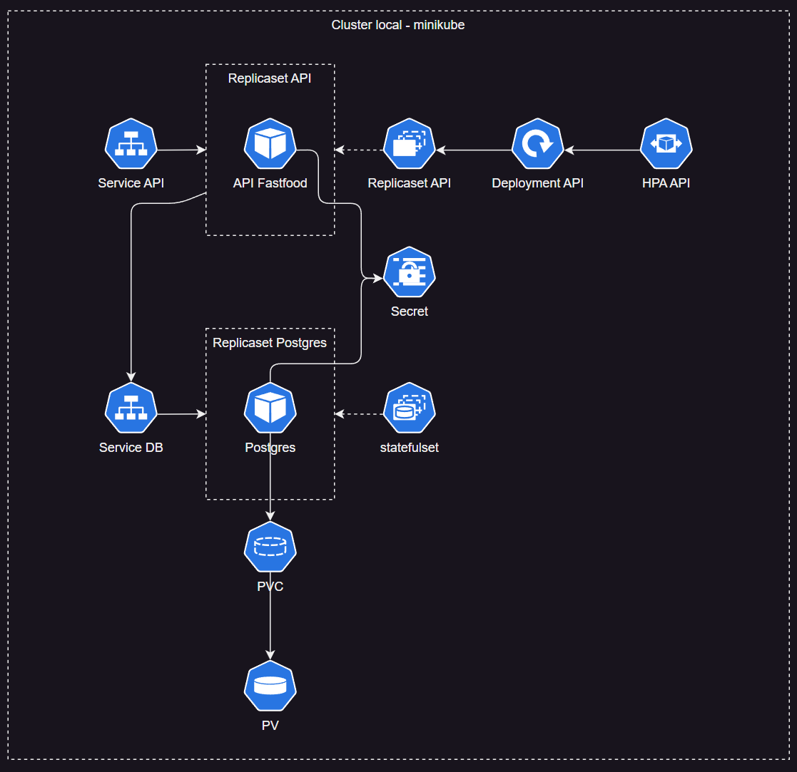

# FastFood Tech Challenge

## 📜 Descrição da Aplicação

Esta aplicação é um desafio técnico para um sistema de gerenciamento de fast food.

É um projeto Node com Typescript, utiliza express para expor a API e Prisma como ORM para comunicação com banco de dados Postgres.

Possui configuração para gerar imagem Docker e criação de recursos kubernetes para consumo.

## 🔗 Link vídeo apresentação
https://youtu.be/mvjAK6U2kzg

## 📌 Pré-requisitos

Antes de começar, certifique-se de ter os seguintes recursos instalados em sua máquina.

- [Minikube](https://minikube.sigs.k8s.io/docs/start)
- [Docker](https://docs.docker.com/get-docker/)

Os seguintes tópicos são interessantes para conhecimento, mas não são essenciais para execução.
- [Docker Compose](https://docs.docker.com/compose/install/)
- [Node](https://nodejs.org/pt)
- [TypeScript](https://www.typescriptlang.org/)
- [Prisma](https://www.prisma.io/docs/getting-started)

## ✨ Execução do projeto

### 🔆 Local

#### Pré requisitos
- Ter um banco postgres rodando localmente no docker. Pode se utilizar do docker compose para criar somente o postgres.
  - Criar um arquivo .env

    `POSTGRES_USER`: `postgres` (Nome de usuário para autenticação no banco de dados PostgreSQL).

    `POSTGRES_PASSWORD`: `postgrespass` (Senha para autenticação no banco de dados PostgreSQL).

    `POSTGRES_DB`: `techchallenge-fastfood` (Nome do banco de dados PostgreSQL a ser utilizado pela aplicação).

    `PGDATA`: `/data/datapostgres` (Diretório onde os dados do PostgreSQL serão armazenados).

    `PG_HOST`: `localhost:5432` (Endereço e porta do servidor PostgreSQL. Pode ser localhost:5432 para desenvolvimento local).

    `PORT`: `3001` (Porta na qual a aplicação será executada).

    `POSTGRES_URL`: `"postgresql://${POSTGRES_USER}:${POSTGRES_PASSWORD}@${PG_HOST}/${POSTGRES_DB}?schema=public"` (URL de conexão completa para o banco de dados PostgreSQL, construída utilizando as variáveis acima).
  - Rodar o comando
    ```sh
    docker-compose up --build
    ```

#### Iniciar a aplicação
Para iniciar a aplicação, rode o comando:
```sh
npm run start:dev
```

Caso tenha subido com as configurações padrão mostradas no pré-requisitos, a aplicação estará disponível em:  
```sh
http://http://localhost:3001/api-docs/
```

### 🔆 Execução com minikube
Iniciar o minikube:
```sh
minikube start
```

Subir a infraestrutura utilizando o kubectl. Obs: É necessário seguir essa ordem de execução para os recursos serem executados corretamente
```sh
# a partir da raiz do projeto baixado
cd kubernetes-infra

# Criando recursos a partir dos manifestos
kubectl apply -f secrets.yaml
kubectl apply -f postgres-service.yaml
kubectl apply -f postgres-pv.yaml
kubectl apply -f postgres-pvc.yaml
kubectl apply -f postgres-statefulset.yaml
kubectl apply -f api-service.yaml
kubectl apply -f api-deployment.yaml
kubectl apply -f api-hpa.yaml
```

Caso você esteja em ambiente windows e utilizando o docker desktop para ter o cluster, é necessário rodar o seguinte comando minikube para expor o serviço da API:

```sh
minikube service tech-challenge-ts-clean-arch-api-service --url
```

Este comando irá retornar uma url localhost com uma porta aleatória de onde será possível interagir com a API. Por exemplo:
`http://127.0.0.1:52358/`

Para acessar o swagger: `http://127.0.0.1:52358/api-docs`

## 📖 Documentação

### 🔆 Swagger
`http://http://localhost:3001/api-docs/`

Também podem ser feitas execuções através do arquivo `client.http` caso tenha a extensão **Rest Client** instalada no VS Code. Nele já contém algumas massas para execução.

### 🔆 Negócio

Pode ser feito cadastros de clientes, caso o cliente desejar, mas não é algo obrigatório. `[POST] /customers`.

Caso o cliente tenha optado pelo cadastro é possível se identificar através do CPF. `[GET] /customers/{cpf}`.

Para ser possível realizar um pedido, é necessário que existam produtos cadastrados para o cliente escolher. Para isso, estão dispostas as seguintes funcionalidades para os produtos:
- Criação do produto `[POST] /products`
- Edição do produto `[PUT] /products/{productId}`
- Listagem dos produtos `[GET] /products`. Podendo filtrá-los também por categoria `[GET] /products?category={category}`
- Deleção de produtos `[DELETE] /products/{productId}`

Com os produtos existindo, já é possível fazer um pedido `[POST] /orders` e realizar o pagamento do mesmo `[POST] /orders/{orderId}/payments`

Também é possível fazer um acompanhamento dos pedidos, se já estão em preparação, prontos e etc. `[GET] /orders`

### 🔆 Arquitetura


#### Requisitos
- **Escalabilidade Automática:**
  O sistema deve utilizar o Horizontal Pod Autoscaler (HPA) para garantir que a API possa escalar automaticamente com base na utilização de CPU. Isso ajudará a manter a performance durante picos de demanda.

- **Persistência de Dados:**
  O banco de dados PostgreSQL deve ser configurado com Persistent Volumes (PV) e Persistent Volume Claims (PVC) para garantir a persistência dos dados, mesmo em caso de falhas ou reinicio nos pods.

- **Segurança:**
  As credenciais de acesso ao banco de dados e outras informações sensíveis devem ser armazenadas em Secrets do Kubernetes para garantir a segurança.

- **Monitoramento e Saúde:**
  Deve ser configurado um readinessProbe e um livenessProbe para a API, garantindo que o Kubernetes possa monitorar a saúde dos pods e reiniciá-los se necessário.

- **Serviços de Rede:**
  Deve ser configurado um Service para expor a API e o banco de dados PostgreSQL, permitindo que os componentes do sistema se comuniquem entre si.